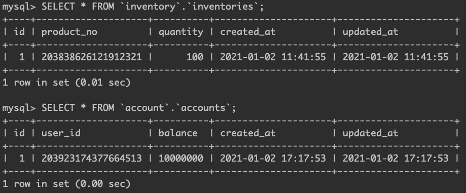
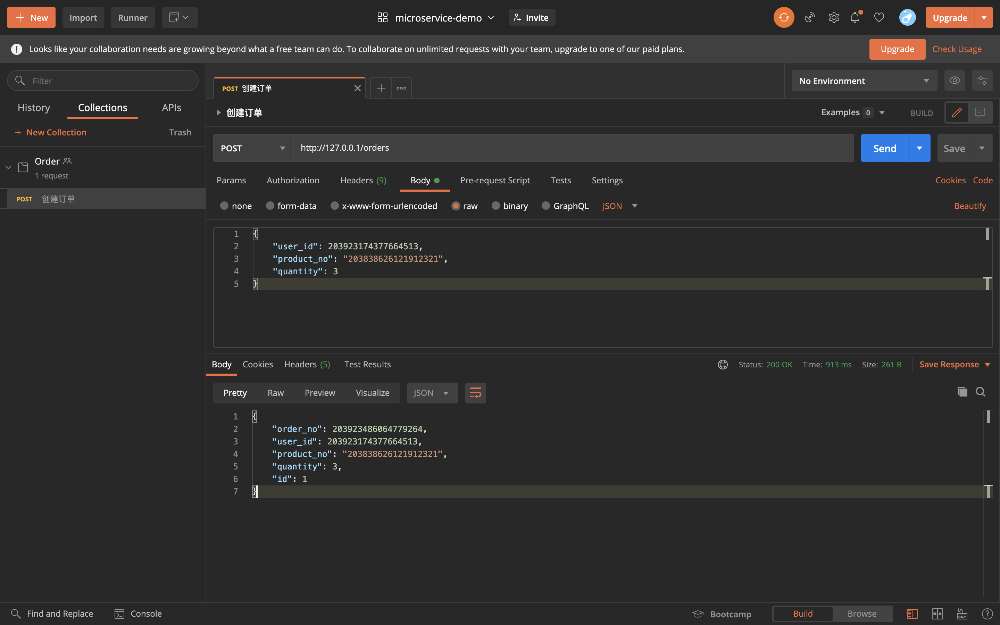

# 项目概述

基于 Hyperf 的微服务 demo

# 整体架构



# 安装运行

> PS: {project} 表示项目根目录

## 开发

### 1. 注释每个服务中 Dockerfile 的 COPY 代码、composer 安装和 ENTRYPOINT 

以 account 服务为例

```dockerfile
FROM microservice-demo-base

LABEL maintainer="Wilson.Li <494747693@qq.com>" version="1.0" license="MIT" app.name="Account"

WORKDIR /opt/www

# Composer Cache
# COPY ./composer.* /opt/www/
# RUN composer install --no-dev --no-scripts

# 注释这两行
# COPY . /opt/www
# RUN composer install --no-dev -o && php bin/hyperf.php

EXPOSE 9501

# 注释这行
# ENTRYPOINT ["php", "/opt/www/bin/hyperf.php", "start"]
```

### 2. 构建 docker 镜像

构建基础 docker 镜像
```shell script
cd {project}/others/base

./build-base.sh
```

构建项目镜像
```shell script
cd {project}

docker-compose build
```

### 3. 运行

```
cd {project}

docker-compose up -d
```

之后进入容器可以执行以下命令，以进入 order 服务为例

```shell script
docker-compose exec order sh
```


## 部署

### 1. 把开发时注释的 Dockerfile 还原

### 2. 构建 docker 镜像

构建项目镜像
```shell script
cd {project}

docker-compose build
```

### 3. 创建 gateway 网络

```shell script
docker network create -d=overlay gateway
```

### 4. 运行 api-gateway

```shell script
cd {project}

docker stack deploy -c api-gateway/docker-stack.yml api-gateway
```

### 5. 创建每个服务的 secret
```shell script
cd {project}

docker secret create account-env others/envs/account-env

docker secret create inventory-env others/envs/inventory-env

docker secret create order-env others/envs/order-env
```

### 6. 运行服务

```shell script
cd {project}

docker stack deploy -c docker-stack.yml demo
```

### 7. 生成测试数据

> PS: container id 可以通过 docker ps 命令查看

创建每个服务的数据库
```shell script
# 连接 mysql

docker exec -it {mysql-container-id} mysql -uroot -proot

# 创建每个服务的数据库
CREATE DATABASE `inventory` DEFAULT CHARACTER SET utf8mb4 COLLATE utf8mb4_unicode_ci;
CREATE DATABASE `account` DEFAULT CHARACTER SET utf8mb4 COLLATE utf8mb4_unicode_ci;
CREATE DATABASE `order` DEFAULT CHARACTER SET utf8mb4 COLLATE utf8mb4_unicode_ci;
```

创建数据库表、生成测试数据
```shell script
# 进入 inventory 服务容器
docker exec -it {inventory-container-id} sh
# 容器内执行
php bin/hyperf.php migrate
php bin/hyperf.php db:seed

# 进入 account 服务容器
docker exec -it {account-container-id} sh
# 容器内执行
php bin/hyperf.php migrate
php bin/hyperf.php db:seed

# 进入 order 服务容器
docker exec -it {order-container-id} sh
# 容器内执行
php bin/hyperf.php migrate
```

### 8. 测试

查看 inventory 和 account 数据库的测试数据



用 postman 测试




